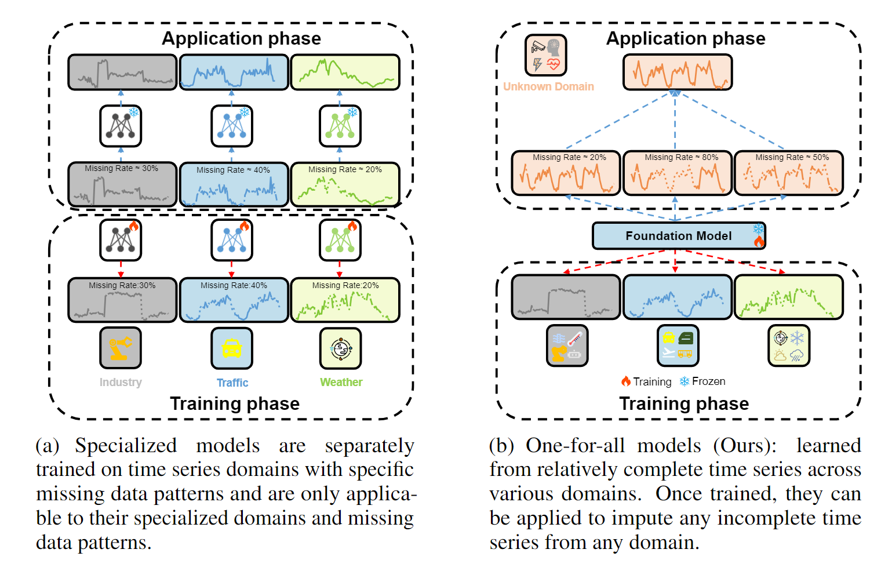
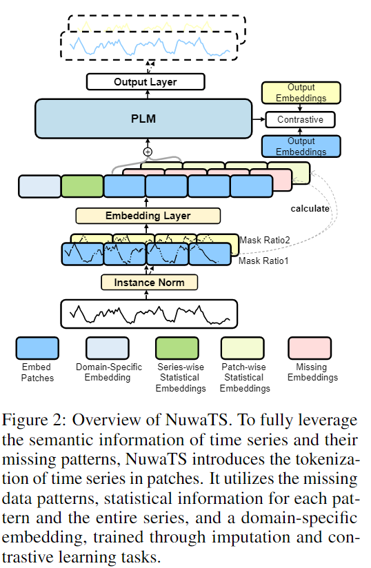
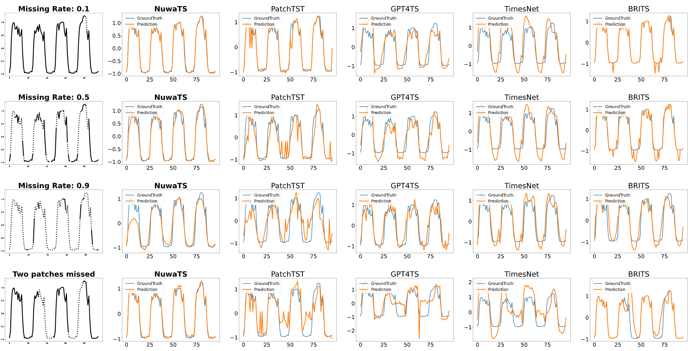
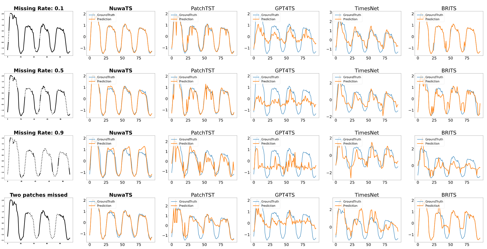
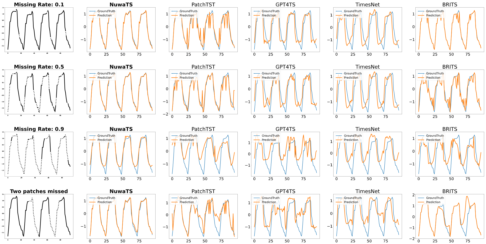
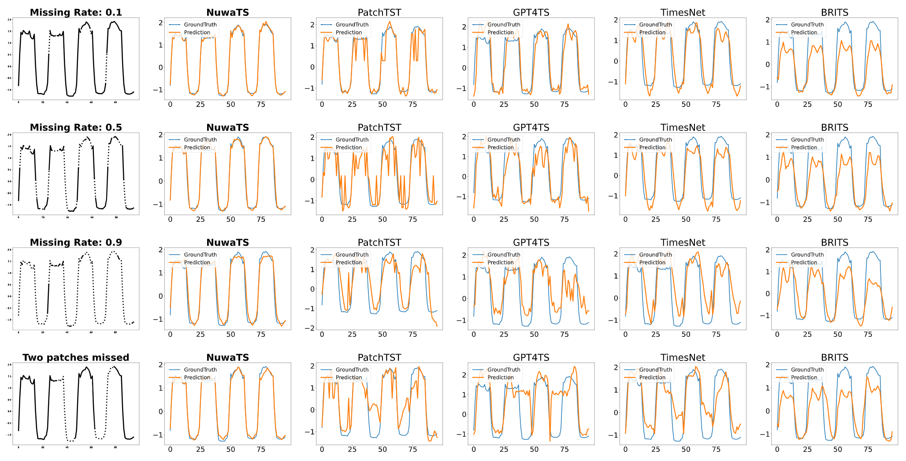

# NuwaTS: a Foundation Model Mending Every Incomplete Time Series

 This is the pytorch implementation for Our Paper: [NuwaTS](https://arxiv.org/abs/2405.15317v2)

You could access the online demo through: [NuwaTS-Colab](https://colab.research.google.com/drive/1jjM6g4N7AqyHjYawZWJdbFgNY7p4ZtGY?usp=sharing)

<p align="center">
    
</p>
<h4 style="text-align: center;">NuwaTS is mending incomplete time series from different domain.</h4> 

Picture is generated by [ChatGLM](https://chatglm.cn/)

## Overview 


Time series imputation plays a crucial role in various real-world systems and has been extensively explored. Models for time series imputation often require specialization, necessitating distinct designs for different domains and missing patterns. In this study, we introduce NuwaTS, a framework to repurpose Pre-trained Language Model (PLM) for general time series imputation. Once trained, this model can be applied to imputation tasks on incomplete time series from any domain with any missing patterns. We begin by devising specific embeddings for each sub-series patch of the incomplete time series. These embeddings encapsulate information about the patch itself, the missing data patterns within the patch, and the patch's statistical characteristics. To enhance the model's adaptability to different missing patterns, we propose a contrastive learning approach to make representations of the same patch more similar across different missing patterns. By combining this contrastive loss with the missing data imputation task, we train PLMs to obtain a one-for-all imputation model. Furthermore, we utilize a plug-and-play layer-wise fine-tuning approach to train domain-specific models. Experimental results demonstrate that leveraging a dataset of over seventeen million time series from diverse domains, we obtain a one-for-all imputation model which outperforms existing domain-specific models across various datasets and missing patterns. Additionally, we find that NuwaTS can be generalized to other time series tasks such as forecasting. 
<p align="center">
    
</p>


## Key Contributions

Our contributions are as follows:
- We introduce a novel solution, NuwaTS, capable of performing missing data imputation tasks on any incomplete time series unseen during the training phase. To the best of our knowledge, this represents the pioneering attempt in this field.
- We present a ``plug-and-play'' fine-tuning technique that seamlessly transforms a one-for-all model into a domain-specific model with minimal data and computational resources, all without modifying the model's original weights. 
- The one-for-all NuwaTS consistently outperforms domain-specific state-of-the-art methods in imputation tasks across nearly all missing rates.
    Moreover, fine-tuned NuwaTS can be extended to time series forecasting, where its forecasting results are comparable to or even better than existing domain-specific time series forecasting models. 
  <p align="center">
      
  </p>

## Visualization

<p align="center">
    
</p>
<p align="center">
    
</p>
<p align="center">
    
</p>
<p align="center">
    
</p>
<p align="center">
    
</p>

We partitioned the dataset along the sensor (variable) dimension into training, validation and test sets in a 1:1:1 ratio.
Thus, all the methods are tested on unseen variables.
Source Code and data can be found in [Visualization](https://github.com/Chengyui/NuwaTS/tree/master/Visualization)
## Data Download

You could download the dataset and checkpoint from here: [Google Drive](https://drive.google.com/drive/folders/1LMESpP-hIssamTlO-rXYJpx4q9p0xzLQ?usp=drive_link)

### Run

```angular2html
python run.py --task_name imputation --is_training 1 
--root_path ./dataset/ --data_path electricity.csv  --model NuwaTS 
--data custom --features M --seq_len 96 --label_len 0 --pred_len 0 
--enc_in 107 --dec_in 107 --c_out 107 --gpt_layer 6 
--batch_size 16 --d_model 768 --patch_size 16 
--des NuwaTS_ECL  --mlp 1 --learning_rate 0.001 
--prefix_length 1 --prefix_tuning --cov_prompt

```

### Acknowledgement
We really thank [MVP-Tuning](https://github.com/kochsnow/MVP-Tuning) for inspiring us how to fine-tune pre-trained language model using [P-tuningV2](https://github.com/THUDM/P-tuning-v2).

We acknowledge [Time-Series-Library](https://github.com/thuml/Time-Series-Library) for supporting such a perfect training pipline.
