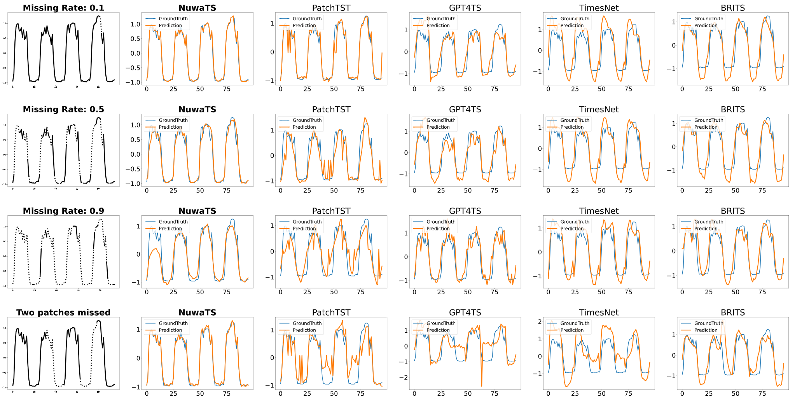
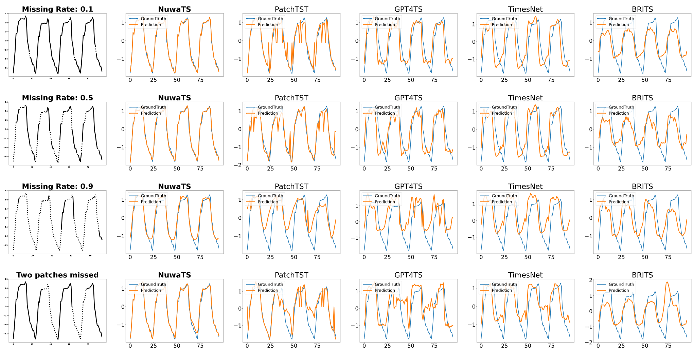

# NuwaTS: a Foundation Model Mending Every Incomplete Time Series

 This is the pytorch implementation for Our Paper: [NuwaTS](https://arxiv.org/abs/2405.15317v2)

You could access the online demo through: [NuwaTS-Colab](https://colab.research.google.com/drive/1jjM6g4N7AqyHjYawZWJdbFgNY7p4ZtGY?usp=sharing)

<p align="center">
    
</p>
<h4 style="text-align: center;">NuwaTS is mending incomplete time series from different domain.</h4> 

Picture is generated by [ChatGLM](https://chatglm.cn/)

## Overview 

Time series imputation is critical for many real-world applications and has been widely studied. However, existing models often require specialized designs tailored to specific missing patterns, variables, or domains which limits their generalizability. In addition, current evaluation frameworks primarily focus on domain-specific tasks and often rely on time-wise train/validation/test data splits, which fail to rigorously assess a model’s ability to generalize across unseen variables or domains. In this paper, we present \textbf{NuwaTS}, a novel framework that repurposes Pre-trained Language Models (PLMs) for general time series imputation. Once trained, NuwaTS can be applied to impute missing data across any domain. We introduce specialized embeddings for each sub-series patch, capturing information about the patch, its missing data patterns, and its statistical characteristics. By combining contrastive learning with the imputation task, we train PLMs to create a versatile, one-for-all imputation model. Additionally, we employ a plug-and-play fine-tuning approach, enabling efficient adaptation to domain-specific tasks with minimal adjustments. To evaluate cross-variable and cross-domain generalization, we propose a new benchmarking protocol that partitions the datasets along the variable dimension. Experimental results on over seventeen million time series samples from diverse domains demonstrate that NuwaTS outperforms state-of-the-art domain-specific models across various datasets under the proposed benchmarking protocol. Furthermore, we show that NuwaTS generalizes to other time series tasks, such as forecasting.
<p align="center">
    
</p>


## Key Contributions

Our contributions are as follows:
- We propose a novel and more practically relevant benchmark which divides the multivariate time series data along the variable dimension for time series imputation, which better assesses a model's ability to generalize to new data.
- We introduce NuwaTS, designed to handle missing data imputation tasks for any incomplete time series. NuwaTS is trained on data from diverse domains and incorporates a light-weight “plug-and-play” fine-tuning technique that requires minimal data and computational resources, making it capable of **mending every incomplete time series**. 
- Under the proposed benchmarking protocol, the one-for-all NuwaTS consistently outperforms domain-specific state-of-the-art methods in imputation tasks across nearly all missing rates. Moreover, fine-tuned NuwaTS can be extended to time series forecasting, where its forecasting results are comparable to or even better than existing domain-specific time series forecasting models.
<p align="center">
      
  </p>

## Visualization

<p align="center">
    
</p>
<p align="center">
    
</p>
<p align="center">
    
</p>
<p align="center">
    
</p>
<p align="center">
    
</p>

We partitioned the dataset along the sensor (variable) dimension into training, validation and test sets in a 1:1:1 ratio.
Thus, all the methods are tested on unseen variables.
Source Code and data can be found in [Visualization](https://github.com/Chengyui/NuwaTS/tree/master/Visualization)
## Data Download

You could download the dataset and checkpoint from here: [Google Drive](https://drive.google.com/drive/folders/1LMESpP-hIssamTlO-rXYJpx4q9p0xzLQ?usp=drive_link)

### Run

```angular2html
python run.py --task_name imputation --is_training 1 
--root_path ./dataset/ --data_path electricity.csv  --model NuwaTS 
--data custom --features M --seq_len 96 --label_len 0 --pred_len 0 
--enc_in 107 --dec_in 107 --c_out 107 --gpt_layer 6 
--batch_size 16 --d_model 768 --patch_size 16 
--des NuwaTS_ECL  --mlp 1 --learning_rate 0.001 
--prefix_length 1 --prefix_tuning --cov_prompt

```

### Acknowledgement
We really thank [MVP-Tuning](https://github.com/kochsnow/MVP-Tuning) for inspiring us how to fine-tune pre-trained language model using [P-tuningV2](https://github.com/THUDM/P-tuning-v2).

We acknowledge [Time-Series-Library](https://github.com/thuml/Time-Series-Library) for supporting such a perfect training pipline.

